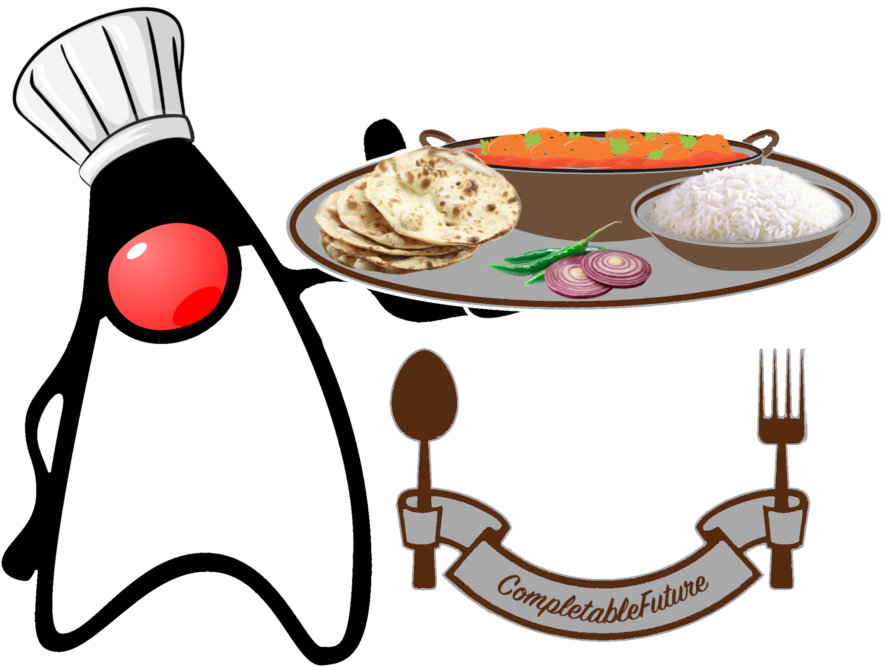
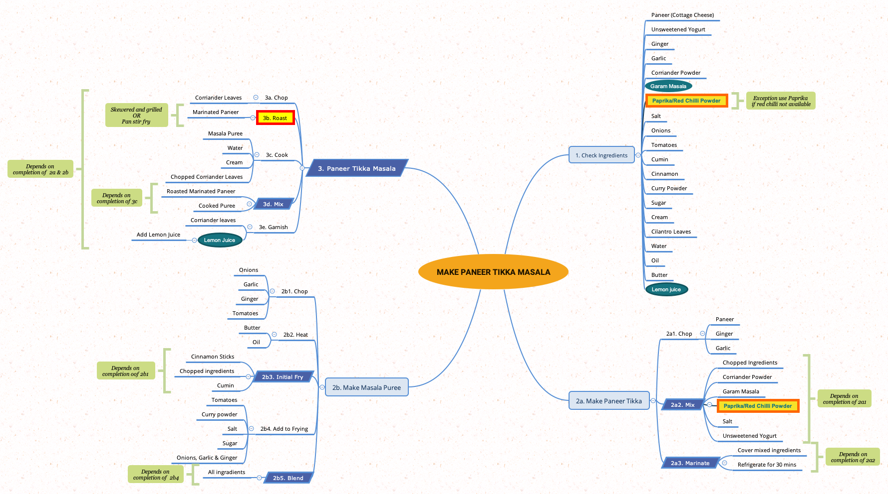

= Java CompletableFuture : A Cooking Recipe Kata
:toc:

image::https://github.com/c-guntur/paneer-tikka-masala/workflows/build/badge.svg?branch=main[link=https://github.com/c-guntur/paneer-tikka-masala/actions?query=workflow%3A%22build%22,title="build"]

`java.util.concurrent.CompletableFuture` is a versatile utility in Java (since Java 8). It provides a means of task execution, both synchronous and asynchronous.

A CompletableFuture implements `java.util.concurrent.Future` (available since Java 5) and `java.util.concurrent.CompletionStage` (available since Java 8) and adds additional methods for operating on tasks.

Some additional documentation about the three in this kata:

* link:assets/docs/Future.adoc[Future]
* link:assets/docs/CompletionStage.adoc[CompletionStage]
* link:assets/docs/CompletableFuture.adoc[CompletableFuture]

== What is a Code-Kata

A code-kata is a coding exercise that builds muscle memory by a practice of programming to arrive
at a known solution.

=== How does one go about with this code kata?

The essence of the exercise (presentation material and code kata) is to demonstrate the
usage patterns for `CompletableFuture`.

This set of code katas rely on fixing broken code. There may be multiple ways to solve the broken code, the
intent is to learn and experiment. There is a driving _main class_ and there are _recipe parts_, which need to be fixed.

The project contains several java classes that fail to cook our recipe. A recipe mindmap to prepare Paneer Tikka Masala is included below.

==== Here are simple steps to use this kata

. Run the main class link:src/kata/java/none/cgutils/recipe/paneer/tikka/PaneerTikkaMasala.java[PaneerTikkaMasala].
. None of the cooking recipe parts will print out on your console.
. Fix the broken/empty sections of code using the TODO and HINT comments.
. Repeat above steps until all recipe parts are printed.
. Check the solutions to see if there are other ways to solve.
(Remember, the solution may be less performant than yours)
. Rinse and repeat (delete and checkout again, then back to Step 1) to build muscle memory.

==== Order of solving
Start in the following oder to fix the broken code or add code where empty. Follow the TODOs and HINTs. Your IDE should list out all TODOs.

. link:src/kata/java/none/cgutils/recipe/paneer/tikka/parts/Part1CheckIngredients.java[Part1CheckIngredients] - Checks for the ingredients for the recipe.
. link:src/kata/java/none/cgutils/recipe/paneer/tikka/parts/Part2aMakePaneerTikka.java[Part2aMakePaneerTikka] - How to make the Paneer Tikka (cottage cheese roast).
. link:src/kata/java/none/cgutils/recipe/paneer/tikka/parts/Part2bMakeMasala.java[Part2bMakeMasala] - How to make the Masala (pureed/spiced gravy).
. link:src/kata/java/none/cgutils/recipe/paneer/tikka/parts/Part3Cooking.java[Part3Cooking] - How to cook the Paneer Tikka and the Masala, then garnish.
. link:src/kata/java/none/cgutils/recipe/paneer/tikka/PaneerTikkaMasala.java[PaneerTikkaMasala] - Plays the role of a chef and orchestrates the entire cooking.

****
*Mission*

Your mission, should you choose to accept it, will be to fix the recipe.
This message will self-destruct in* *NaN* minutes
****

=== Requirements
How to prepare for coding along

This kata is developed as a Java maven project. Ensure that you have:

1. Apache Maven 3.6.x or above. _Tested with Apache Maven 3.6.3_.
Link: https://maven.apache.org/download.cgi

1. JDK 11 or above. _Tested with OpenJDK 15_.
Link: http://jdk.java.net/15/

1. Your favorite Java IDE. _IntelliJ IDEA Ultimate was used to develop this kata_.

== Project Structure
----
|____IDE                    <----- Contains Run Configurations and Live Templates for IntelliJ
|____pom.xml                <----- The POM for running maven commands
|____README.adoc            <----- This file
|____assets                 <----- Images and docs linked above
|____src
| |____main
| | |____resources
| | |____java
| | | |____none
| | | | |____cgutils
| | | | | |____recipe
| | | | | | |____paneer
| | | | | | | |____tikka    <----- Common classes shared by Kata and Solution portions
| |____kata
| | |____java
| | | |____none
| | | | |____cgutils
| | | | | |____recipe
| | | | | | |____paneer
| | | | | | | |____tikka    <----- The broken recipe code, that needs to be fixed
| |____solution
| | |____java
| | | |____none
| | | | |____cgutils
| | | | | |____recipe
| | | | | | |____paneer
| | | | | | | |____tikka    <----- Solutions
| |____test
| | |____java
| | | |____none
| | | | |____cgutils
| | | | | |____recipe
| | | | | | |____paneer
| | | | | | | |____tikka    <----- Some tests for utilities used in this project

----

=== Solutions

.Solutions for the test
|===
|Kata | Solution
|link:src/kata/java/none/cgutils/recipe/paneer/tikka/parts/Part1CheckIngredients.java[Part1CheckIngredients]|link:src/solution/java/none/cgutils/recipe/paneer/tikka/parts/SolutionPart1CheckIngredients.java[SolutionPart1CheckIngredients]
|link:src/kata/java/none/cgutils/recipe/paneer/tikka/parts/Part2aMakePaneerTikka.java[Part2aMakePaneerTikka]|link:src/solution/java/none/cgutils/recipe/paneer/tikka/parts/SolutionPart2aMakePaneerTikka.java[SolutionPart2aMakePaneerTikka]
|link:src/kata/java/none/cgutils/recipe/paneer/tikka/parts/Part2bMakeMasala.java[Part2bMakeMasala]          |link:src/solution/java/none/cgutils/recipe/paneer/tikka/parts/SolutionPart2bMakeMasala.java[SolutionPart2bMakeMasala]
|link:src/kata/java/none/cgutils/recipe/paneer/tikka/parts/Part3Cooking.java[Part3Cooking]                  |link:src/solution/java/none/cgutils/recipe/paneer/tikka/parts/SolutionPart3Cooking.java[SolutionPart3Cooking]
|link:src/kata/java/none/cgutils/recipe/paneer/tikka/PaneerTikkaMasala.java[PaneerTikkaMasala]              |link:src/solution/java/none/cgutils/recipe/paneer/tikka/SolutionPaneerTikkaMasala.java[SolutionPaneerTikkaMasala]
|===

== Take Away

The key take-away from this kata is a solid understanding of the Java CompletableFuture API.
